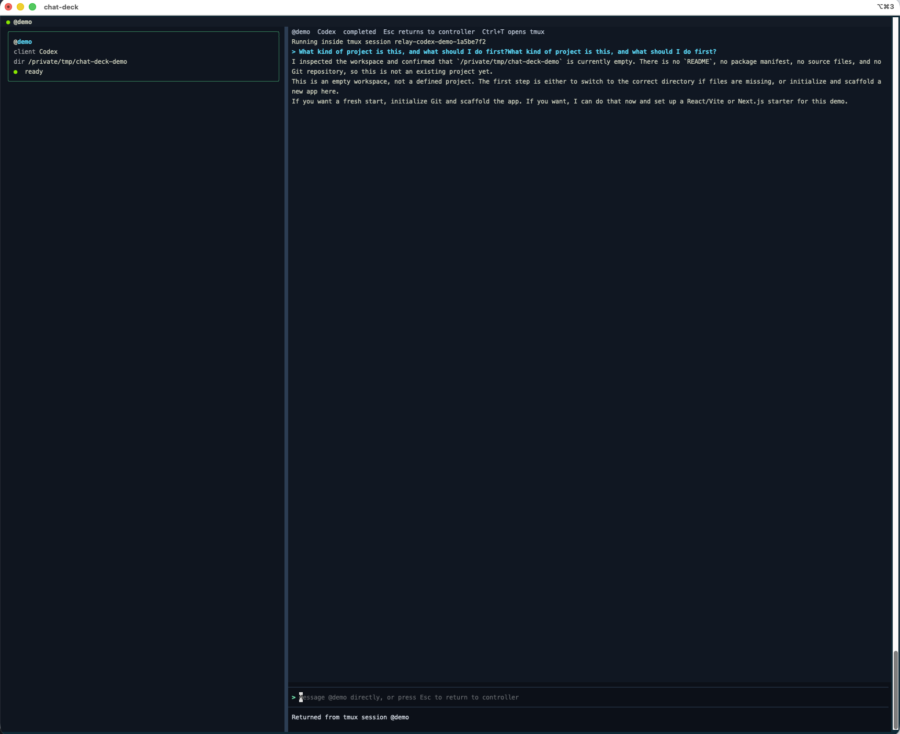

# Chat Deck

> 一个面向 Claude Code 和 Codex 的 chat-first 多 agent 控制台，基于 Bun、OpenTUI 和 tmux 构建。

Chat Deck 让你可以在一个终端 UI 中统一管理多个 Claude Code 和 Codex agent。每个 agent 都运行在自己独立的 tmux 会话里，也可以工作在完全不同的目录。你不需要一直盯着原始终端日志，而是可以在聊天式主面板中与当前选中的 agent 对话，并在任务完成后直接收到结构化总结。



> 当前状态：alpha / experimental
>
> 当前包名和 CLI 名称是：`chat-deck`

[English README](./README.md)

---

## 为什么做 Chat Deck？

同时跑多个 Claude Code 或 Codex 会话其实不难，难的是让这些会话始终可见、可切换，并且保持“以对话为中心”的体验。

tmux 和终端 tab 很擅长管理终端本身。Chat Deck 位于它们之上，提供的是 chat-first 的控制层：统一入口、agent 状态可见、直接点名某个 agent，以及结构化完成总结。

---

## 技术栈

- Bun
- TypeScript
- OpenTUI
- tmux

---

## 当前这次 OpenTUI 重构

这个项目已经从 Python/Textual 重构到了 OpenTUI。

目前这版 TypeScript 重构保留了最核心的 Chat Deck 工作流：

- 常驻侧边栏会话状态
- 当前选中 agent 的聊天式主面板
- 基于 tmux 的 Claude Code / Codex / Copilot CLI worker
- `/new`、`/agents`、`/close`、`/attach`、`@agent-name ...`
- `Ctrl+1..9`、`Ctrl+T`、`Ctrl+X`、`Ctrl+B`、`Esc`
- 类似 `create a codex session in /path/to/project` 这样的自然语言建会话
- 基于 `<TASK_DONE>...</TASK_DONE>` 的结构化完成总结解析

一些 Python 版本里更重的语义回传能力，这次没有直接照搬，后续需要在 TypeScript 里重新补。

---

## 依赖前提

你的机器上至少需要这些命令：

```bash
which bun
which zig
which tmux
which claude
which codex
which copilot
```

如果你只是想跑 TUI，本身最关键的是 `bun` 和 `zig`。如果你想跑真实 worker，还需要 `tmux`，以及 `claude` / `codex` 至少安装一个。

即使你是通过 npm 安装 `chat-deck`，运行时也仍然需要 Bun。npm 包本身只是一个很薄的启动器，真正的应用仍然是通过 `bun` 启动的。

---

## 安装

clone 仓库后安装依赖：

```bash
git clone git@github.com:zhuanyongxigua/chat-deck.git
cd chat-deck
bun install
```

如果你希望这个 checkout 直接提供全局 `chat-deck` 命令：

```bash
bun link
```

如果以后通过 npm 发布或安装，运行时要求仍然一样：

```bash
npm install -g chat-deck
bun --version
chat-deck
```

---

## 运行

直接从仓库里启动：

```bash
bun run dev
```

`bun run dev` 现在会监听 `src/` 变化，并在文件变更后自动重启 Chat Deck。

如果已经 `bun link`：

```bash
chat-deck
```

如果你只想单次启动、不启用自动重启：

```bash
bun run start
```

---

## 校验

运行最小测试集：

```bash
bun test
```

运行类型检查：

```bash
bun run check
```

---

## 命令

### 创建 agent

```bash
/new codex <name> <cwd>
/new claude <name> <cwd>
/new copilot <name> <cwd>
```

也可以在工作目录后面直接附加 client 参数：

```bash
/new codex worker /path/to/project --model gpt-5 --profile fast
/new claude reviewer /path/to/project --dangerously-skip-permissions
```

### 会话管理

- `/agents` 列出当前 agent
- `/attach [agent-name]` 进入当前选中或指定 agent 的原生 tmux 会话
- `/close` 关闭当前 active agent
- `/close <agent-name>` 关闭指定 agent，并销毁背后的 tmux session

### 消息路由

- `@agent-name ...` 直接给指定 agent 发消息

---

## 快捷键

- `Ctrl+1..9` 选择 agent
- `Ctrl+T` 进入当前 agent 的原生 tmux 会话
- `Ctrl+X` 关闭当前 active agent，并杀掉背后的 tmux session
- `Ctrl+B` 隐藏或显示侧边栏
- `Esc` 返回 controller

---

## 当前限制

- Claude hooks 和 Codex notify/app-server 那套更细的语义回传，还没有在 OpenTUI 版本里重建
- 当前完成总结仍然依赖 worker 正确输出 `TASK_DONE` 协议
- 这次 OpenTUI 重构还没在当前环境真实跑起来，因为当前环境里没有安装 Bun 和 Zig

---

## 协议

MIT
